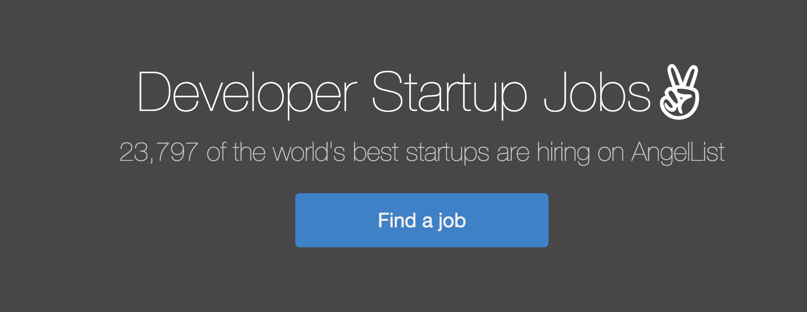
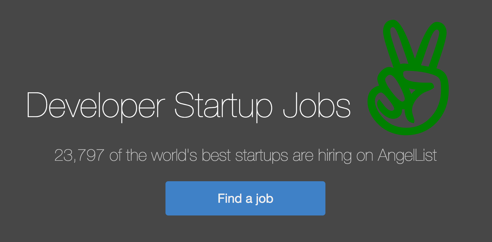

<!--
Creator: Ilias Tsangaris
Editor: John Barela 
Market: SF, Denver
-->

#DOM Manipulation & Events

## Why is this important?
<!-- framing the "why" in big-picture/real world examples -->
*This workshop is important because:*

DOM manipulation is the bread and butter of dynamic web design - you will do it, in some way, for almost every interactive element you add to your website. We're going to start with some very small examples, but all of these techniques can be used at a higher level as well.

## What are the objectives?
<!-- specific/measurable goal for students to achieve -->
*After this workshop, developers will be able to:*

* Select & modify DOM elements
* Create & append DOM elements
* Style CSS with Javascript
* Set event listeners

## Where should we be now?
<!-- call out the skills that are prerequisites -->
*Before this workshop, developers should already be able to:*

- Use chrome developer tools to interact with the DOM
- Create javascript objects and functions
- Be resourceful Googlers

##Select & Modify: Str8-up H4cked
*This workshop will be guided, but self-driven.*

Good news - you've been recruited by General Assembly's Global Disruption Department to hack to hack Angel List. You and a partner are going to pair up to manipulate various aspects of their web page.

*Note:* A [reference guide](#web-api-reference) to the aspects of the Web API is at the bottom of the workshop.

####Mission A

Time to be an [Egor Homakov](http://techli.com/2012/03/how-a-russian-developer-hijacked-github-to-help-the-rails-community/) and get some publicity. 

Head to the Angel List's [job board](https://angel.co/developer/jobs) page to get started. Select each company name and change them all to `WDI Rulez: str8-up h4cked`.

[CFU]: # (What would be some of the first steps. Prod for opening the console and comment on the Easter Egg.)

---

    
**Hint:**

    <figure>
		* How can we identify all the startup elements? Do they share any HTML attributes?

		* Once we've identified an attribute they all share, how can we select them all?
		* Tip: try [`document.querySelectorAll(...)`](https://developer.mozilla.org/en-US/docs/Web/API/Document/querySelectorAll) to grab everything that matches a query. Note this is different to `.querySelector` which just selects the first item it finds.

		* Now that we have a collection, how do we change the text off all of them at once?
		* Tip: iterate through the collection and reset the `textContent` of each.
    </figure>

##Create & Append: Angels Everywhere

####Mission B

Let add the AngelList V to the end of the page title. 

---

**Hint:**

* Grab the page title

* Create a span element in the console with the classes `.fontello-angellist`

* Add an ID for good measure (it could help us select it again later)
	* Tip: try `setAttribute`

* Append it to the DOM

##Styling with Javascript: Big Kitty

####Mission C

Our angel V is not big or bold enough! Let's increase its size and give it a fun color.

---

**Hint:**

`.style`

##Set Event Listeners

####Mission D

Register an event which fires when our angel V is clicked that creates an alert message saying "Fund Me!"

---

**Hint:**

`.addEventListener`

##Bonus Mission

####Mission E

When the angel V is hovered-over, change its color to red.

##Closing Thoughts

Knowledge of the Web API allows us to affect and add dynamic behavior to HTML pages.

<h2 id="web-api-reference">Reference Guide</h2>
**General Concepts**

* `for` loop

**Document API**

* `.querySelector`
* `.querySelectorAll`
* `.createElement`

**Element API**

* `.appendChild`
* `.textContent`
* `.setAttribute`
* `.style` (`.<someCSSProperty>`)
* `.addEventListener`

####More worth knowing

**Element API**

* `.removeChild`
* `.parentNode`
* `.children`
* `.getAttribute`
* `.removeEventListener`

For documentation reference the Mozilla Developer Network, aka [MDN](https://developer.mozilla.org/en-US/)

## Licensing
All content is licensed under a CC­BY­NC­SA 4.0 license.
All software code is licensed under GNU GPLv3. For commercial use or alternative licensing, please contact legal@ga.co.
